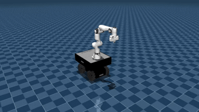

# FR3 on Summit XLS Example



The FR3 XLS example demonstrates the mobile manipulator controller interface. It optimizes whole-body motion and returns separate mobile-base and manipulator commands.

## Run

```bash
cd examples/python
python3 dyros_robot_controller_example.py --robot_name fr3_xls
```

```bash
cd examples/C++/build
./dyros_robot_controller_example fr3_xls
```

## Modes

| Key | Mode | Description |
| --- | --- | --- |
| `1` | Home | Move the manipulator to a predefined home configuration |
| `2` | QPIK | Compute whole-body mobile manipulator velocity commands |
| `3` | Gravity Compensation W QPID | Compute torque-level compensation through QPID |

## Output Commands

The controller splits optimized output into:

- Mobile command vector
- Manipulator command vector

This mirrors the C++ and Python APIs:

```python
success, qdot_mobile_desired, qdot_mani_desired = robot_controller.QPIK_cubic(
    link_task_data,
    duration,
)
```

## Files

| File | Purpose |
| --- | --- |
| `examples/C++/src/fr3_xls_controller.cpp` | C++ controller implementation |
| `examples/C++/include/fr3_xls_controller.hpp` | C++ controller declaration |
| `examples/python/fr3_xls_controller.py` | Python controller implementation |
| `examples/robots/fr3_xls` | Combined mobile manipulator assets |
